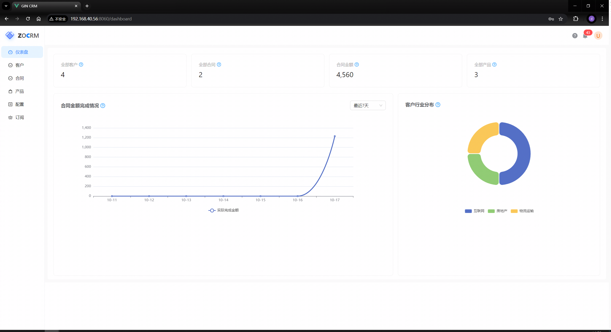
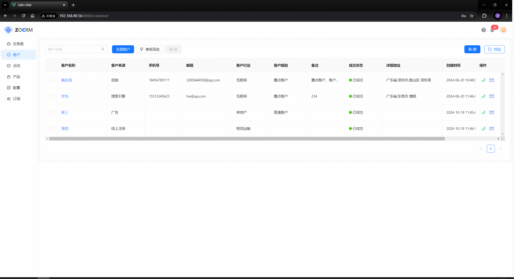
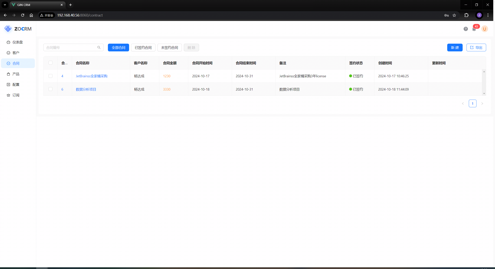
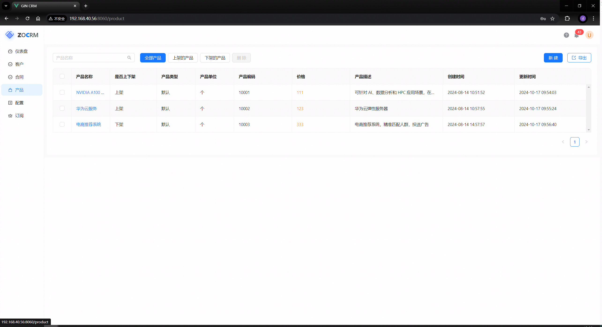
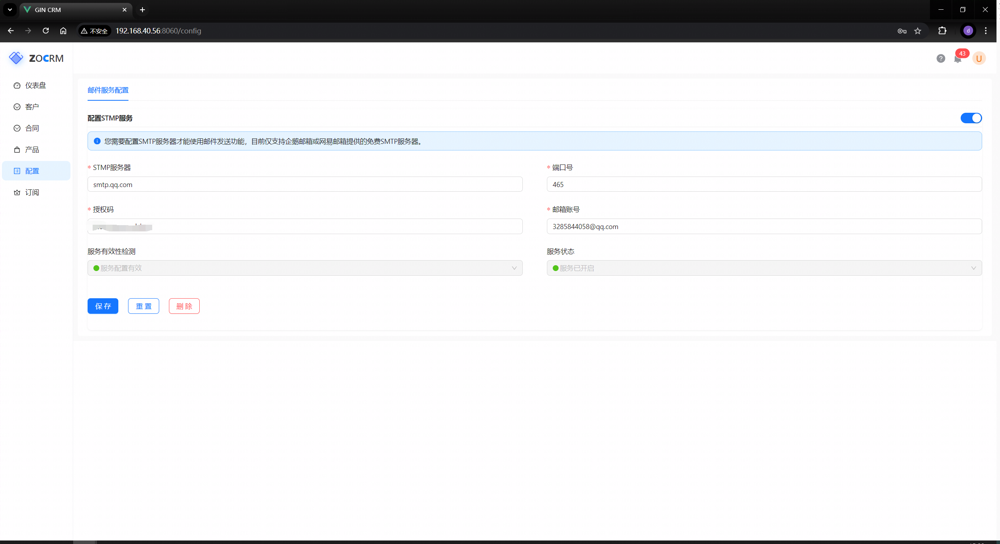
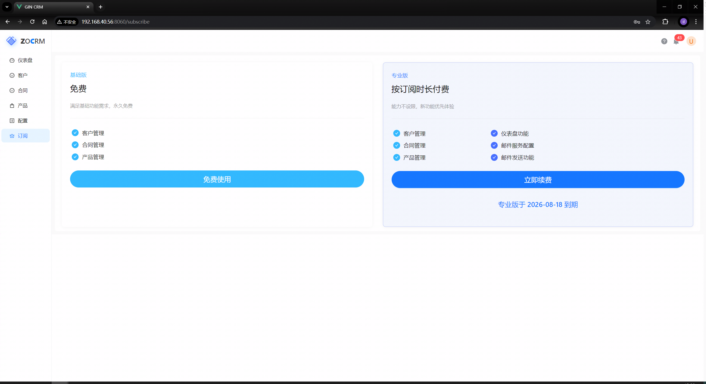
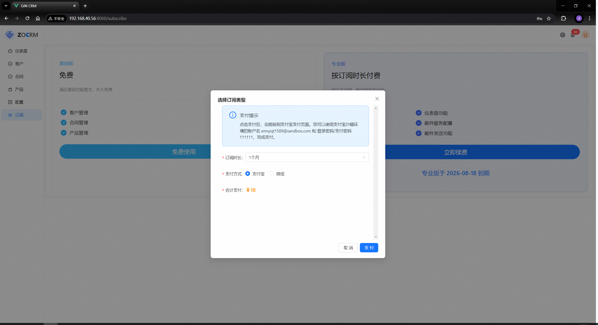

# 项目简介

本项目是对zchengo开源的 **https://github.com/zchengo/crm** 项目的学习，即跟着开源的项目写一遍，并对小部分地方进行了修改、优化，对无法正常运行的地方进行了修复。

感谢zchengo的开源。


# 功能清单

- [x] 登录
- [x] 仪表盘
- [x] 客户模块
- [x] 合同模块
- [x] 产品模块
- [x] 配置模块
- [x] 订阅模块
- [x] 操作日志
- [x] 支付宝支付
- [ ] 微信支付
- [ ] 注册
- [ ] 找回密码


# 项目预览

















# 快速开始

## 环境

| 名称           | 版本    | 说明 |
| -------------- | ------- | ---- |
| Go             | 1.20.2  |      |
| MySQL          | 8.0.32  |      |
| Redis          | 4.0.8   |      |
| node           | 18.15.0 |      |
| vite           | 5.2.8   |      |
| Vue            | 3.4.21  |      |
| vue-router     | 4.3.0   |      |
| ant-design-vue | 4.2.3   |      |


## 运行

1.克隆项目到本地

2.将db/gincrm.sql数据导入到数据库

3.将server/config.yml.template复制一份，改名为config.yml，修改配置信息为自己的信息

4.终端行执行：

启动服务端：

```bash
cd server
go mod tidy
go run main.go
```

启动前端

```bash
cd web
npm install
npm run dev
```


# License

[MIT License](https://gitee.com/iskaliyang/gincrm/blob/master/LICENSE)

Copyright (c) 2024 iskali

